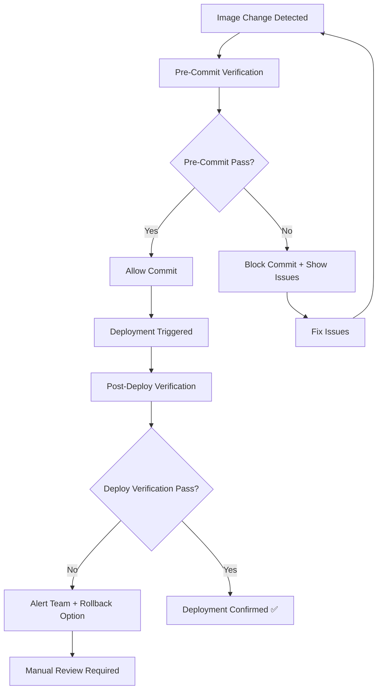

# Image Verification & Management System

## Comprehensive Documentation for Visual Deployment Validation

> **Mission Critical**: This system prevents image deployment failures by providing actual visual proof that changes took effect. Mandatory for all future image work across any project.

---

## 📋 Table of Contents

1. [System Overview](#system-overview)
2. [Installation & Setup](#installation--setup)
3. [Core Components](#core-components)
4. [Mandatory Verification Process](#mandatory-verification-process)
5. [Workflow Integration](#workflow-integration)
6. [Configuration Management](#configuration-management)
7. [Troubleshooting Guide](#troubleshooting-guide)
8. [Best Practices](#best-practices)
9. [API Reference](#api-reference)
10. [Advanced Features](#advanced-features)

---

## 🎯 System Overview

### Purpose
The Image Verification & Management System ensures that every image change in web deployments is properly validated through automated visual comparison. It prevents the common deployment failures where image changes appear successful but don't actually take effect.

### Key Features

#### 🔍 **Visual Verification Agent**
- **Screenshot Capture**: Automated before/after screenshots using Selenium WebDriver
- **Multi-Algorithm Comparison**: SSIM, pixel-by-pixel, perceptual hashing, histogram analysis
- **Visual Diff Reports**: Comprehensive difference visualization with heatmaps
- **Mobile & Desktop Testing**: Responsive design verification across viewports

#### 🚀 **Deployment Integration**
- **CI/CD Pipeline Integration**: GitHub Actions, Vercel, custom webhooks
- **Git Hook Automation**: Pre-commit and post-receive verification
- **Real-time Monitoring**: Automatic deployment change detection
- **Rollback Capabilities**: Automated failure detection and recovery procedures

#### 📊 **Reporting & Analytics**
- **Interactive HTML Reports**: Detailed visual comparison reports
- **Batch Processing**: Multiple URL verification with summary reports
- **Notification System**: Slack, email, and webhook notifications
- **Historical Tracking**: Deployment success/failure trends

### Architecture

```
┌─────────────────────────────────────────────────────────────┐
│                 Image Verification System                    │
├─────────────────┬───────────────────┬───────────────────────┤
│  Capture Agent  │  Comparison Engine │  Deployment Monitor   │
│                 │                   │                       │
│ • Screenshots   │ • SSIM Analysis   │ • Git Hook Integration│
│ • Multi-viewport│ • Pixel Diff      │ • CI/CD Workflows     │
│ • Error Handling│ • Hash Comparison │ • Webhook Handlers    │
└─────────────────┴───────────────────┴───────────────────────┘
```

---

## 🛠 Installation & Setup

### Prerequisites

```bash
# System Requirements
- Python 3.8+
- Chrome/Chromium Browser
- ChromeDriver (auto-managed)
- Git (for hook integration)
```

### Step 1: Install Dependencies

```bash
# Clone or download the verification system files
pip install -r requirements_image_verification.txt

# Verify installation
python image_verification_agent.py --help
```

### Step 2: Environment Setup

```bash
# Automated setup (recommended)
python image_verification_utils.py setup

# Manual setup
mkdir -p verification_screenshots verification_reports verification_logs verification_backups
```

### Step 3: Configuration

```bash
# Generate default configuration
python deployment_verification_workflow.py --mode setup

# Edit configuration files
nano verification_configs/default_config.json
```

### Step 4: Integration Setup

```bash
# Install Git hooks
python deployment_verification_workflow.py --mode setup

# Test installation
python image_verification_agent.py --url "https://example.com" --test-name "installation_test"
```

---

## 🧩 Core Components

### 1. Image Verification Agent (`image_verification_agent.py`)

The core verification engine with comprehensive image analysis capabilities.

#### Key Classes:

- **`ImageVerificationAgent`**: Main orchestrator for all verification operations
- **`VerificationConfig`**: Configuration management and validation
- **`VerificationResult`**: Standardized result structure with detailed metrics

#### Usage Examples:

```python
# Basic verification
from image_verification_agent import ImageVerificationAgent, VerificationConfig

config = VerificationConfig(
    similarity_threshold=0.95,
    viewport_width=1920,
    viewport_height=1080
)

agent = ImageVerificationAgent(config)
result = agent.verify_deployment(
    url="https://your-website.com",
    test_name="homepage_verification"
)

print(f"Success: {result.success}")
print(f"Similarity: {result.similarity_score:.3f}")
print(f"Report: {result.diff_image}")
```

#### Command Line Interface:

```bash
# Single page verification
python image_verification_agent.py \
    --url "https://your-website.com" \
    --test-name "homepage_check" \
    --mobile

# With custom before screenshot
python image_verification_agent.py \
    --url "https://your-website.com" \
    --test-name "after_deployment" \
    --before "./screenshots/before_deploy.png"
```

### 2. Verification Utilities (`image_verification_utils.py`)

Advanced utilities for batch processing, optimization, and workflow management.

#### Key Classes:

- **`DeploymentConfig`**: Deployment-specific configuration and monitoring
- **`ImageOptimizer`**: Image optimization for web deployment
- **`BatchProcessor`**: Efficient multi-URL verification processing
- **`VerificationWorkflow`**: Complete deployment verification orchestration

#### Batch Processing Example:

```python
from image_verification_utils import BatchProcessor
from image_verification_agent import ImageVerificationAgent

agent = ImageVerificationAgent()
processor = BatchProcessor(agent, max_workers=4)

# Process URLs from file
results = processor.process_url_list("urls_to_verify.json")

# Results analysis
passed = sum(1 for r in results if r['success'])
print(f"Verification: {passed}/{len(results)} passed")
```

### 3. Deployment Workflow (`deployment_verification_workflow.py`)

Complete deployment integration with CI/CD pipelines and automation systems.

#### Integration Modes:

- **`pre-commit`**: Validate images before Git commits
- **`post-deploy`**: Verify successful deployment
- **`ci`**: Continuous integration pipeline verification
- **`webhook`**: API endpoint for external triggers

#### Workflow Example:

```python
from deployment_verification_workflow import DeploymentVerifier

verifier = DeploymentVerifier("config.json")

# Post-deployment verification
results = verifier.verify_post_deploy(
    base_url="https://your-website.com",
    commit_hash="abc123"
)

# Results handling
if results['failed_tests'] == 0:
    print("✅ Deployment verified successfully")
else:
    print(f"❌ {results['failed_tests']} tests failed")
    # Trigger rollback procedures
```

---

## ⚡ Mandatory Verification Process

### 🚨 **CRITICAL REQUIREMENT**: All Image Changes Must Be Verified

This verification process is **mandatory** for ALL image-related changes across any project to prevent deployment failures.

### Process Flow



### Step-by-Step Mandatory Workflow

#### 1. **Pre-Commit Verification** (Automatic)

When committing files containing image changes:

```bash
# Automatic via Git hook
git add modified-image.png
git commit -m "Update hero image"

# Manual verification (if needed)
python deployment_verification_workflow.py \
    --mode pre-commit \
    --files "modified-image.png,another-image.jpg"
```

**Verification Checks:**
- ✅ File size validation (< 5MB recommended)
- ✅ Dimension limits (< 4000px recommended)
- ✅ Format optimization (JPEG/PNG/WebP preferred)
- ✅ Basic image integrity

**Failure Actions:**
- 🚫 **Block commit** until issues resolved
- 📋 **Display optimization suggestions**
- 💡 **Provide bypass option** (`git commit --no-verify`)

#### 2. **Deployment Monitoring** (Automatic)

Monitor deployment services for changes:

```python
# In deployment pipeline
monitor = DeploymentMonitor(config)
deployment_detected = monitor.wait_for_deployment(
    "https://your-website.com",
    timeout=300
)

if deployment_detected:
    # Proceed to post-deploy verification
    trigger_verification()
```

#### 3. **Post-Deploy Verification** (Automatic)

Comprehensive visual verification after deployment:

```bash
# Triggered automatically or manually
python deployment_verification_workflow.py \
    --mode post-deploy \
    --base-url "https://your-website.com" \
    --commit "abc123def"
```

**Verification Process:**
1. 📸 **Capture after-deployment screenshots**
2. 🔍 **Compare with before screenshots** using multiple algorithms
3. 📊 **Generate detailed diff reports**
4. 📧 **Send notifications** based on results
5. 🔄 **Provide rollback recommendations** if failures detected

#### 4. **Failure Response Protocol**

When verification fails:

```bash
# Immediate actions
1. 🚨 Alert development team via Slack/email
2. 📋 Generate detailed failure report
3. 🔄 Provide rollback instructions
4. 📸 Archive failed deployment screenshots
5. 🐛 Create GitHub issue (if applicable)
```

### Verification Success Criteria

#### ✅ **PASS Criteria**
- **Similarity Score**: > 0.85 (but not identical)
- **Visual Changes**: Detected but within expected parameters
- **Load Success**: All images load without 404 errors
- **Responsive**: Works across mobile and desktop viewports

#### ❌ **FAIL Criteria**
- **Identical Images**: No changes detected (deployment likely failed)
- **Broken Images**: 404 errors or loading failures
- **Extreme Differences**: > 50% pixel differences (unexpected changes)
- **Timeout**: Screenshots fail to capture within time limit

#### ⚠️ **REVIEW Required**
- **Moderate Differences**: 15-50% pixel differences
- **Layout Shifts**: Significant element repositioning
- **Color Changes**: Major color palette shifts
- **Missing Elements**: Expected elements not visible

---

## 🔧 Workflow Integration

### Git Hook Integration

#### Pre-Commit Hook (Automatic Installation)

```bash
# Install via setup command
python deployment_verification_workflow.py --mode setup

# Manual installation
cat > .git/hooks/pre-commit << 'EOF'
#!/bin/bash
echo "🔍 Verifying image changes..."
python3 deployment_verification_workflow.py --mode pre-commit --files "$(git diff --cached --name-only | grep -E '\.(png|jpg|jpeg|gif|svg|webp)$' | tr '\n' ',')"
EOF
chmod +x .git/hooks/pre-commit
```

#### Post-Receive Hook (Server-Side)

```bash
# For deployment servers
cat > .git/hooks/post-receive << 'EOF'
#!/bin/bash
while read oldrev newrev refname; do
    if [[ $refname == "refs/heads/main" ]]; then
        python3 deployment_verification_workflow.py --mode post-deploy --base-url "$DEPLOYMENT_URL" --commit "$newrev"
    fi
done
EOF
```

### CI/CD Pipeline Integration

#### GitHub Actions

Automatic workflow file creation:

```bash
python deployment_verification_workflow.py --mode setup
```

Generated workflow includes:
- ✅ Automated screenshot capture
- ✅ Multi-browser testing
- ✅ PR comment integration
- ✅ Artifact upload
- ✅ Failure notifications

#### Manual GitHub Actions Setup

```yaml
# .github/workflows/image-verification.yml
name: Image Verification
on: [push, pull_request]

jobs:
  verify-images:
    runs-on: ubuntu-latest
    steps:
      - uses: actions/checkout@v4
      - uses: actions/setup-python@v4
        with:
          python-version: '3.11'
      
      - name: Install dependencies
        run: |
          pip install -r requirements_image_verification.txt
          
      - name: Verify deployment
        run: |
          python deployment_verification_workflow.py \
            --mode ci \
            --base-url "https://your-preview-url.vercel.app"
        env:
          SLACK_WEBHOOK: ${{ secrets.SLACK_WEBHOOK }}
```

#### Vercel Integration

```json
{
  "builds": [
    {
      "src": "package.json",
      "use": "@vercel/static-build"
    }
  ],
  "functions": {
    "verification_webhook.py": {
      "runtime": "python3.9"
    }
  },
  "routes": [
    {
      "src": "/api/verify",
      "dest": "verification_webhook.py"
    }
  ]
}
```

### Webhook Integration

#### API Endpoint Setup

```python
# verification_webhook.py (Vercel Function)
from http.server import BaseHTTPRequestHandler
import json
import subprocess

class handler(BaseHTTPRequestHandler):
    def do_POST(self):
        if self.path == '/api/verify':
            # Handle verification request
            result = subprocess.run([
                'python3', 'deployment_verification_workflow.py',
                '--mode', 'webhook',
                '--url', data.get('url', '')
            ], capture_output=True, text=True)
            
            # Return results
            self.send_response(200 if result.returncode == 0 else 500)
            self.send_header('Content-type', 'application/json')
            self.end_headers()
```

#### Webhook Usage

```bash
# Trigger verification via webhook
curl -X POST https://your-site.com/api/verify \
  -H "Content-Type: application/json" \
  -d '{"url": "https://your-site.com/updated-page"}'
```

---

## ⚙️ Configuration Management

### Configuration Structure

```json
{
  "verification": {
    "screenshot_dir": "./verification_screenshots",
    "report_dir": "./verification_reports",
    "max_wait_time": 30,
    "viewport_width": 1920,
    "viewport_height": 1080,
    "mobile_width": 375,
    "mobile_height": 667,
    "similarity_threshold": 0.95,
    "pixel_diff_threshold": 10,
    "hash_threshold": 5
  },
  "deployment": {
    "base_url": "https://your-website.com",
    "pages_to_verify": [
      {"name": "homepage", "url": "/"},
      {"name": "about", "url": "/about"},
      {"name": "products", "url": "/products"}
    ],
    "wait_after_deployment": 30,
    "retry_attempts": 3,
    "retry_delay": 10
  },
  "notifications": {
    "slack_webhook": "https://hooks.slack.com/...",
    "notification_webhook": "https://your-api.com/notify",
    "email_notifications": ["dev-team@company.com"]
  }
}
```

### Environment Variables

```bash
# Core configuration
export VERIFICATION_CONFIG='{"verification":{"similarity_threshold":0.90}}'
export SLACK_WEBHOOK="https://hooks.slack.com/services/..."

# Chrome configuration
export CHROME_BIN="/usr/bin/google-chrome"
export CHROMEDRIVER_PATH="/usr/bin/chromedriver"

# Advanced settings
export VERIFICATION_ENABLED="true"
export VERIFICATION_DEBUG="false"
export MAX_CONCURRENT_VERIFICATIONS="4"
```

### Multi-Environment Configuration

```python
# config_manager.py
import os
import json

class ConfigManager:
    @staticmethod
    def get_environment_config():
        env = os.environ.get('ENVIRONMENT', 'development')
        
        configs = {
            'development': {
                'base_url': 'http://localhost:3000',
                'similarity_threshold': 0.85,
                'debug': True
            },
            'staging': {
                'base_url': 'https://staging.yoursite.com',
                'similarity_threshold': 0.90,
                'notifications_enabled': True
            },
            'production': {
                'base_url': 'https://yoursite.com',
                'similarity_threshold': 0.95,
                'notifications_enabled': True,
                'retry_attempts': 5
            }
        }
        
        return configs.get(env, configs['development'])
```

---

## 🔧 Troubleshooting Guide

### Common Issues & Solutions

#### 1. **ChromeDriver Issues**

**Problem**: WebDriver fails to start
```
selenium.common.exceptions.WebDriverException: Message: 'chromedriver' executable needs to be in PATH
```

**Solutions**:
```bash
# Option 1: Use webdriver-manager (automatic)
pip install webdriver-manager

# Option 2: Manual installation
# Download ChromeDriver from https://chromedriver.chromium.org/
sudo cp chromedriver /usr/local/bin/
sudo chmod +x /usr/local/bin/chromedriver

# Option 3: Set path explicitly
export CHROMEDRIVER_PATH="/path/to/chromedriver"
```

#### 2. **Screenshot Capture Failures**

**Problem**: Screenshots are blank or fail to capture

**Diagnostic Commands**:
```bash
# Test Chrome installation
google-chrome --version
chromedriver --version

# Test basic screenshot
python -c "
from selenium import webdriver
from selenium.webdriver.chrome.options import Options
options = Options()
options.add_argument('--headless')
options.add_argument('--no-sandbox')
driver = webdriver.Chrome(options=options)
driver.get('https://example.com')
driver.save_screenshot('test.png')
driver.quit()
print('Screenshot test completed')
"
```

**Solutions**:
- ✅ Add `--disable-gpu` Chrome option
- ✅ Use `--no-sandbox` for Docker/CI environments
- ✅ Increase wait times for slow-loading pages
- ✅ Check viewport dimensions and scaling

#### 3. **Image Comparison Failures**

**Problem**: Comparison algorithms fail or give inconsistent results

**Debugging**:
```python
# Debug comparison process
from image_verification_agent import ImageVerificationAgent
import cv2
import numpy as np

agent = ImageVerificationAgent()

# Load images manually
img1 = cv2.imread('before.png')
img2 = cv2.imread('after.png')

print(f"Image 1 shape: {img1.shape if img1 is not None else 'Failed to load'}")
print(f"Image 2 shape: {img2.shape if img2 is not None else 'Failed to load'}")

# Test comparison
if img1 is not None and img2 is not None:
    results = agent.compare_images('before.png', 'after.png', 'debug_diff.png')
    print(f"Comparison results: {results}")
```

**Solutions**:
- ✅ Verify image files exist and are readable
- ✅ Check image format compatibility
- ✅ Ensure sufficient disk space for processing
- ✅ Adjust similarity thresholds for your use case

#### 4. **Network & Timeout Issues**

**Problem**: Verification fails due to network timeouts

**Configuration**:
```python
config = VerificationConfig(
    max_wait_time=60,  # Increase timeout
    viewport_width=1280,  # Reduce viewport for faster loading
    viewport_height=720
)

# Add retry logic
for attempt in range(3):
    try:
        result = agent.verify_deployment(url, test_name)
        if result.success:
            break
    except Exception as e:
        print(f"Attempt {attempt + 1} failed: {e}")
        time.sleep(10)  # Wait before retry
```

#### 5. **Permission Issues**

**Problem**: File system permission errors

```bash
# Fix directory permissions
sudo chown -R $USER:$USER verification_screenshots/
sudo chown -R $USER:$USER verification_reports/
chmod -R 755 verification_*

# For Docker containers
USER root
RUN mkdir -p /app/verification_screenshots && \
    chmod 777 /app/verification_screenshots
USER appuser
```

### Performance Optimization

#### 1. **Speed Improvements**

```python
# Optimize Chrome options for speed
chrome_options.add_argument('--disable-images')  # For layout testing
chrome_options.add_argument('--disable-javascript')  # If not needed
chrome_options.add_argument('--disable-extensions')
chrome_options.add_argument('--disable-plugins')
chrome_options.add_argument('--disable-dev-shm-usage')
```

#### 2. **Memory Management**

```python
# Process large batches efficiently
def process_large_batch(urls, batch_size=10):
    results = []
    for i in range(0, len(urls), batch_size):
        batch = urls[i:i + batch_size]
        batch_results = processor.process_url_list(batch)
        results.extend(batch_results)
        
        # Clear memory between batches
        import gc
        gc.collect()
    
    return results
```

#### 3. **Parallel Processing**

```python
# Configure optimal worker count
import multiprocessing

optimal_workers = min(multiprocessing.cpu_count(), 4)
processor = BatchProcessor(agent, max_workers=optimal_workers)
```

### Logging & Debugging

#### 1. **Enable Debug Logging**

```python
import logging
logging.basicConfig(level=logging.DEBUG)

# Or in environment
export VERIFICATION_DEBUG="true"
```

#### 2. **Custom Log Analysis**

```bash
# Analyze verification logs
grep "ERROR" verification_logs/*.log
grep "Screenshot captured" verification_logs/*.log | wc -l
grep "Comparison completed" verification_logs/*.log
```

#### 3. **Performance Monitoring**

```python
# Add performance tracking
import time
from functools import wraps

def monitor_performance(func):
    @wraps(func)
    def wrapper(*args, **kwargs):
        start_time = time.time()
        result = func(*args, **kwargs)
        duration = time.time() - start_time
        print(f"{func.__name__} took {duration:.2f}s")
        return result
    return wrapper

# Apply to verification methods
@monitor_performance
def verify_deployment(self, url, test_name):
    # ... existing code
```

---

## 📘 Best Practices

### 1. **Image Optimization Before Deployment**

#### Pre-Deployment Checklist:
- ✅ **Compress images** to appropriate quality levels (85% JPEG recommended)
- ✅ **Resize for web** (max 1920px width for most use cases)
- ✅ **Choose optimal format** (JPEG for photos, PNG for graphics, WebP for modern browsers)
- ✅ **Generate responsive variants** for different screen sizes

```python
# Automated image optimization
from image_verification_utils import ImageOptimizer

optimizer = ImageOptimizer()

# Basic optimization
optimizer.optimize_for_web(
    input_path="original_image.jpg",
    output_path="optimized_image.jpg",
    quality=85,
    max_width=1920
)

# Generate responsive variants
responsive_images = optimizer.create_responsive_images(
    input_path="hero_image.jpg",
    output_dir="./responsive_images/"
)
```

### 2. **Verification Strategy**

#### Test Coverage Priority:
1. **Critical Pages**: Homepage, key landing pages, checkout flows
2. **Image-Heavy Pages**: Galleries, product catalogs, portfolios
3. **Responsive Breakpoints**: Mobile (375px), tablet (768px), desktop (1200px+)
4. **Dynamic Content**: Pages with user-uploaded images or CMS content

#### Verification Frequency:
- **Every Commit**: Pre-commit hooks for image changes
- **Every Deployment**: Full verification suite
- **Weekly**: Comprehensive audit of all pages
- **After Major Updates**: Extended verification with manual review

### 3. **Configuration Management**

#### Environment-Specific Settings:
```json
{
  "development": {
    "similarity_threshold": 0.80,
    "skip_mobile_testing": true,
    "debug_mode": true
  },
  "staging": {
    "similarity_threshold": 0.90,
    "full_responsive_testing": true,
    "notification_level": "errors_only"
  },
  "production": {
    "similarity_threshold": 0.95,
    "full_responsive_testing": true,
    "notification_level": "all_results",
    "enable_rollback_suggestions": true
  }
}
```

### 4. **Error Handling & Recovery**

#### Graceful Degradation:
```python
class RobustVerificationAgent(ImageVerificationAgent):
    def verify_with_fallback(self, url, test_name):
        try:
            # Primary verification method
            return self.verify_deployment(url, test_name)
        except WebDriverException as e:
            # Fallback to simplified verification
            return self.simple_verification(url, test_name)
        except Exception as e:
            # Log error and return safe failure
            self.logger.error(f"All verification methods failed: {e}")
            return self.create_failure_result(url, test_name, str(e))
```

### 5. **Team Collaboration**

#### Shared Configuration:
- ✅ **Version control** configuration files
- ✅ **Document thresholds** and their rationale
- ✅ **Share test suites** across team members
- ✅ **Standardize naming conventions** for tests and reports

#### Knowledge Sharing:
```markdown
# Team Verification Guidelines

## When to Run Manual Verification:
- Major design overhauls
- New page templates
- Critical bug fixes affecting layout
- Before production releases

## How to Interpret Results:
- SSIM > 0.95: Minor acceptable changes
- SSIM 0.80-0.95: Moderate changes, review recommended
- SSIM < 0.80: Major changes, manual inspection required

## Escalation Process:
1. Automated failure → Developer review
2. Repeated failures → Team lead review  
3. Production failures → Immediate rollback + post-mortem
```

### 6. **Performance & Scalability**

#### Efficient Batch Processing:
```python
# Process URLs in optimized batches
def smart_batch_processing(urls, system_resources):
    # Determine optimal batch size based on available resources
    memory_gb = psutil.virtual_memory().total / (1024**3)
    cpu_cores = multiprocessing.cpu_count()
    
    if memory_gb > 16 and cpu_cores > 8:
        batch_size = 20
        max_workers = 6
    elif memory_gb > 8 and cpu_cores > 4:
        batch_size = 10
        max_workers = 4
    else:
        batch_size = 5
        max_workers = 2
    
    return process_batches(urls, batch_size, max_workers)
```

#### Resource Monitoring:
```python
import psutil

def monitor_verification_resources():
    """Monitor system resources during verification"""
    cpu_usage = psutil.cpu_percent(interval=1)
    memory_usage = psutil.virtual_memory().percent
    disk_usage = psutil.disk_usage('/').percent
    
    if cpu_usage > 80 or memory_usage > 85:
        print("⚠️ High resource usage detected - consider reducing batch size")
    
    return {
        'cpu': cpu_usage,
        'memory': memory_usage,
        'disk': disk_usage
    }
```

---

## 📚 API Reference

### Core Classes

#### `ImageVerificationAgent`

**Constructor:**
```python
ImageVerificationAgent(config: Optional[VerificationConfig] = None)
```

**Methods:**

##### `capture_screenshot(url, output_path, mobile=False, wait_for=None)`
Capture screenshot of web page.

**Parameters:**
- `url` (str): URL to capture
- `output_path` (str): Path to save screenshot
- `mobile` (bool): Use mobile viewport
- `wait_for` (str): CSS selector to wait for

**Returns:** `bool` - Success status

##### `compare_images(image1_path, image2_path, output_diff_path)`
Compare two images using multiple algorithms.

**Returns:** `Dict[str, Any]` - Detailed comparison metrics

##### `verify_deployment(url, test_name, before_screenshot=None, mobile=False)`
Complete deployment verification workflow.

**Returns:** `VerificationResult` - Comprehensive verification results

#### `VerificationConfig`

Configuration dataclass with the following attributes:

```python
@dataclass
class VerificationConfig:
    screenshot_dir: str = "./verification_screenshots"
    report_dir: str = "./verification_reports"
    max_wait_time: int = 30
    viewport_width: int = 1920
    viewport_height: int = 1080
    mobile_width: int = 375
    mobile_height: int = 667
    similarity_threshold: float = 0.95
    pixel_diff_threshold: int = 10
    hash_threshold: int = 5
```

#### `VerificationResult`

Result dataclass containing:

```python
@dataclass
class VerificationResult:
    success: bool
    similarity_score: float
    pixel_differences: int
    hash_difference: int
    before_image: str
    after_image: str
    diff_image: str
    timestamp: str
    url: str
    test_name: str
    message: str
    details: Dict[str, Any]
```

### Utility Classes

#### `BatchProcessor`

```python
# Initialize
processor = BatchProcessor(agent, max_workers=4)

# Process URL list
results = processor.process_url_list("urls.json")
```

#### `DeploymentMonitor`

```python
# Initialize with config
monitor = DeploymentMonitor(deployment_config)

# Wait for deployment
deployed = monitor.wait_for_deployment(url, timeout=300)
```

#### `VerificationWorkflow`

```python
# Full deployment workflow
workflow = VerificationWorkflow(agent, deployment_config)
summary = workflow.full_deployment_workflow()
```

### Command Line Interface

#### Primary Commands:

```bash
# Single URL verification
python image_verification_agent.py \
    --url "https://example.com" \
    --test-name "homepage_test" \
    [--mobile] [--before "screenshot.png"] [--config "config.json"]

# Deployment workflow
python deployment_verification_workflow.py \
    --mode {pre-commit|post-deploy|ci|webhook|setup} \
    [--config "config.json"] \
    [--base-url "https://example.com"] \
    [--files "file1.png,file2.jpg"]

# Environment setup
python image_verification_utils.py setup
```

#### Return Codes:
- `0`: Success
- `1`: Verification failed
- `2`: Configuration error
- `3`: System error

### Environment Variables

```bash
# Core configuration
VERIFICATION_CONFIG='{"similarity_threshold": 0.90}'
SLACK_WEBHOOK="https://hooks.slack.com/..."
NOTIFICATION_WEBHOOK="https://api.example.com/notify"

# Chrome/WebDriver
CHROME_BIN="/usr/bin/google-chrome"
CHROMEDRIVER_PATH="/usr/bin/chromedriver"

# System settings
MAX_CONCURRENT_VERIFICATIONS="4"
VERIFICATION_TIMEOUT="300"
DEBUG_MODE="false"
```

---

## 🚀 Advanced Features

### 1. **AI-Enhanced Image Analysis**

#### Object Detection Integration:
```python
# Optional: Add TensorFlow/PyTorch for advanced analysis
import tensorflow as tf

class AIEnhancedVerificationAgent(ImageVerificationAgent):
    def __init__(self, config=None):
        super().__init__(config)
        self.object_detector = self._load_object_detection_model()
    
    def detect_layout_changes(self, before_image, after_image):
        """Detect significant layout changes using object detection"""
        before_objects = self.object_detector.detect(before_image)
        after_objects = self.object_detector.detect(after_image)
        
        # Compare detected objects and their positions
        layout_score = self._compare_object_layouts(before_objects, after_objects)
        return layout_score
```

### 2. **Multi-Browser Testing**

#### Cross-Browser Verification:
```python
from selenium import webdriver
from selenium.webdriver.firefox.options import Options as FirefoxOptions
from selenium.webdriver.safari.options import Options as SafariOptions

class MultiBrowserVerificationAgent(ImageVerificationAgent):
    def verify_across_browsers(self, url, test_name):
        browsers = ['chrome', 'firefox', 'safari']
        results = {}
        
        for browser in browsers:
            try:
                driver = self._get_browser_driver(browser)
                result = self._verify_with_driver(driver, url, test_name)
                results[browser] = result
            except Exception as e:
                results[browser] = {'error': str(e)}
                
        return self._aggregate_browser_results(results)
```

### 3. **Performance Monitoring**

#### Page Load Performance Integration:
```python
class PerformanceAwareVerificationAgent(ImageVerificationAgent):
    def verify_with_performance_metrics(self, url, test_name):
        start_time = time.time()
        
        # Capture performance metrics
        performance_data = self._capture_performance_metrics(url)
        
        # Standard verification
        result = self.verify_deployment(url, test_name)
        
        # Enhance result with performance data
        result.details['performance'] = performance_data
        result.details['verification_duration'] = time.time() - start_time
        
        return result
    
    def _capture_performance_metrics(self, url):
        """Capture page load performance metrics"""
        driver = self._setup_driver()
        driver.get(url)
        
        # Get performance timing data
        timing = driver.execute_script("""
            var performance = window.performance;
            var timing = performance.timing;
            return {
                'dom_loading': timing.domLoading,
                'dom_interactive': timing.domInteractive,
                'dom_complete': timing.domComplete,
                'load_event_end': timing.loadEventEnd
            };
        """)
        
        driver.quit()
        return timing
```

### 4. **Custom Comparison Algorithms**

#### Domain-Specific Comparison:
```python
class CustomComparisonAgent(ImageVerificationAgent):
    def compare_with_custom_algorithm(self, img1_path, img2_path, comparison_type='web_layout'):
        """Custom comparison algorithms for specific use cases"""
        
        if comparison_type == 'web_layout':
            return self._compare_web_layout(img1_path, img2_path)
        elif comparison_type == 'color_scheme':
            return self._compare_color_schemes(img1_path, img2_path)
        elif comparison_type == 'text_content':
            return self._compare_text_content(img1_path, img2_path)
        else:
            return super().compare_images(img1_path, img2_path, 'output.png')
    
    def _compare_web_layout(self, img1_path, img2_path):
        """Compare web page layouts focusing on structural elements"""
        # Edge detection for layout comparison
        img1 = cv2.imread(img1_path, 0)
        img2 = cv2.imread(img2_path, 0)
        
        edges1 = cv2.Canny(img1, 50, 150)
        edges2 = cv2.Canny(img2, 50, 150)
        
        # Compare edge patterns
        edge_similarity = cv2.matchTemplate(edges1, edges2, cv2.TM_CCOEFF_NORMED)
        
        return {
            'layout_similarity': float(np.max(edge_similarity)),
            'structural_changes': self._analyze_structural_changes(edges1, edges2)
        }
```

### 5. **Real-Time Monitoring Dashboard**

#### Live Verification Dashboard:
```python
from flask import Flask, render_template, jsonify
import threading

class VerificationDashboard:
    def __init__(self, verification_agent):
        self.app = Flask(__name__)
        self.agent = verification_agent
        self.current_status = {}
        self.setup_routes()
    
    def setup_routes(self):
        @self.app.route('/')
        def dashboard():
            return render_template('dashboard.html')
        
        @self.app.route('/api/status')
        def get_status():
            return jsonify(self.current_status)
        
        @self.app.route('/api/verify/<path:url>')
        def trigger_verification(url):
            # Start verification in background
            thread = threading.Thread(
                target=self._background_verification,
                args=(url,)
            )
            thread.start()
            return jsonify({'status': 'started'})
    
    def _background_verification(self, url):
        self.current_status[url] = {'status': 'running'}
        try:
            result = self.agent.verify_deployment(url, 'dashboard_test')
            self.current_status[url] = {
                'status': 'completed',
                'success': result.success,
                'similarity': result.similarity_score
            }
        except Exception as e:
            self.current_status[url] = {
                'status': 'error',
                'message': str(e)
            }
```

### 6. **Machine Learning Integration**

#### Anomaly Detection:
```python
from sklearn.ensemble import IsolationForest
import numpy as np

class MLEnhancedVerificationAgent(ImageVerificationAgent):
    def __init__(self, config=None):
        super().__init__(config)
        self.anomaly_detector = IsolationForest(contamination=0.1)
        self.historical_features = []
    
    def detect_anomalies(self, verification_result):
        """Detect anomalous verification results using ML"""
        features = self._extract_features(verification_result)
        
        if len(self.historical_features) > 50:
            # Train anomaly detector
            X = np.array(self.historical_features)
            self.anomaly_detector.fit(X)
            
            # Predict anomaly
            anomaly_score = self.anomaly_detector.decision_function([features])[0]
            is_anomaly = self.anomaly_detector.predict([features])[0] == -1
            
            return {
                'is_anomaly': is_anomaly,
                'anomaly_score': anomaly_score,
                'confidence': abs(anomaly_score)
            }
        else:
            # Not enough historical data
            self.historical_features.append(features)
            return {'is_anomaly': False, 'message': 'Building baseline data'}
    
    def _extract_features(self, result):
        """Extract features for ML analysis"""
        return [
            result.similarity_score,
            result.pixel_differences,
            result.hash_difference,
            len(result.details.get('feature_matches', [])),
            result.details.get('histogram_correlation', 0)
        ]
```

---

## 🎯 Conclusion

The Image Verification & Management System provides a comprehensive solution for preventing image deployment failures through automated visual validation. By implementing this system as a **mandatory** part of your development workflow, you ensure that every image change is properly validated with actual visual proof.

### Key Benefits:
- ✅ **Prevents Silent Failures**: Catches deployment issues that appear successful but don't take effect
- ✅ **Automated Integration**: Seamlessly integrates with existing CI/CD pipelines
- ✅ **Comprehensive Analysis**: Multiple comparison algorithms for thorough validation
- ✅ **Team Collaboration**: Shared configuration and standardized processes
- ✅ **Scalable Architecture**: Handles projects of any size with batch processing

### Implementation Checklist:
- [ ] Install system components and dependencies
- [ ] Configure verification thresholds for your project
- [ ] Set up Git hooks for automatic pre-commit verification  
- [ ] Integrate with CI/CD pipeline (GitHub Actions, Vercel, etc.)
- [ ] Configure team notifications (Slack, email)
- [ ] Train team on verification workflow and best practices
- [ ] Establish failure response procedures
- [ ] Schedule regular verification audits

### Support & Maintenance:
- 📧 **Issues**: Document any problems with detailed logs and screenshots
- 🔄 **Updates**: Keep dependencies updated, especially ChromeDriver and Selenium
- 📊 **Monitoring**: Review verification success rates and adjust thresholds as needed
- 🎓 **Training**: Ensure all team members understand the verification process

---

**Remember**: This verification system is mandatory for ALL image-related work. No exceptions. The goal is to eliminate image deployment failures through automated visual validation and provide your team with confidence that changes actually take effect.

For questions, support, or contributions to this system, refer to the troubleshooting guide or contact the development team.

---

*Last Updated: September 2024*  
*Version: 1.0*  
*Moonlight Analytica Development Team*