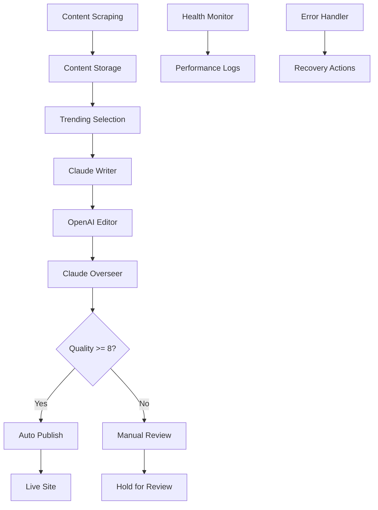

# Moonlight Analytica Content Automation Agent

A production-ready specialist agent that handles the complete content automation pipeline for Moonlight Analytica's blog system.

## 🚀 Features

### ✅ Current Working System
- **3-AI Collaborative Content Generation**: Claude Writer → OpenAI Editor → Claude Overseer
- **Quality Assurance**: 8/10+ quality threshold with iterative improvement
- **Database Integration**: Proper Supabase schema with error handling  
- **Content Scraping**: TechCrunch, The Verge, Ars Technica, Hacker News
- **HTML Publishing**: Direct integration with static site
- **Comprehensive Logging**: Performance metrics and error tracking
- **Health Monitoring**: System status and component health checks

### 🔧 Production-Ready Features
- **Error Recovery**: Graceful handling of API failures and database issues
- **Field Validation**: Proper database schema without field mismatches
- **Automated Pipeline**: From content scraping to live publication
- **Quality Control**: Only 8+ quality articles get published
- **Performance Monitoring**: Detailed metrics and logging

## 📁 File Structure

```
C:\Users\alima\
├── content-automation-agent.js    # Main agent implementation
├── package.json                   # Dependencies and scripts
├── .env.example                   # Environment configuration template
├── README-CONTENT-AUTOMATION.md   # This documentation
│
├── scripts/                       # Utility scripts
│   ├── setup-database.js         # Database schema setup
│   ├── generate-single-article.js # Test article generation
│   ├── publish-ready-articles.js  # Publishing to live site
│   └── health-check.js           # System health monitoring
│
└── articles/                      # Published HTML articles (auto-created)
    ├── ai-breakthrough-analysis.html
    ├── tech-industry-trends.html  
    └── ...
```

## 🛠️ Quick Setup

### 1. Install Dependencies
```bash
npm install
```

### 2. Configure Environment
```bash
# Copy environment template
cp .env.example .env

# Edit .env with your actual API keys:
SUPABASE_URL=http://localhost:54321
SUPABASE_ANON_KEY=your_supabase_key_here
ANTHROPIC_API_KEY=your_claude_key_here
OPENAI_API_KEY=your_openai_key_here
```

### 3. Setup Database
```bash
npm run setup:db
```

### 4. Test Article Generation
```bash
npm run generate:article
```

### 5. Publish Ready Articles
```bash
npm run publish:ready
```

## 🎯 Usage Examples

### Generate and Test a Single Article
```bash
npm run generate:article
```
**Output:**
```
🤖 Initializing Content Automation Agent...
📰 Scraping latest content...
🎯 Generating article with 3-AI collaborative approach...
   Step 1: Claude Writer (Initial Draft)
   Step 2: OpenAI Editor (Enhancement & SEO)  
   Step 3: Claude Overseer (Quality Assessment)

✅ Article Generation Complete!
━━━━━━━━━━━━━━━━━━━━━━━━━━━━━━━━━━━━━━━━━━━━━━━━━━
📰 Title: AI Breakthrough: Latest Developments Reshaping Technology
📊 Quality Score: 8.5/10
📝 Word Count: 1,247
🤖 AI Writers: claude → openai → claude-overseer
🔄 Iterations: 3
📋 Status: Ready to Publish
```

### System Health Check
```bash
npm run monitor:health
```
**Output:**
```
🏥 Performing Content Automation Agent Health Check
═══════════════════════════════════════════════════════════

🗄️  Database Connection
──────────────────────────────
   ✅ Database connection: OK

🤖 AI Services  
──────────────────────────────
   ✅ Claude AI: OK
   ✅ OpenAI: OK

📰 Content Sources
──────────────────────────────
   ✅ techcrunch: OK
   ✅ theverge: OK
   ✅ arstechnica: OK

🏥 Health Summary
═══════════════════════════════════════════════════════════
   🟢 Overall Status: HEALTHY
   📊 Components: 5/5 operational
```

## 🔄 3-AI Collaborative Pipeline

The agent uses a sophisticated 3-step AI collaboration process:

### Step 1: Claude Writer 
- **Role**: Initial article creation
- **Focus**: Original analysis and professional tech journalism
- **Output**: Structured 800-1200 word article with insights

### Step 2: OpenAI Editor
- **Role**: Content enhancement and SEO optimization
- **Focus**: Readability, structure, meta descriptions, keywords
- **Output**: Polished article with SEO elements

### Step 3: Claude Overseer
- **Role**: Quality assessment and final polish
- **Focus**: Brand voice, accuracy verification, quality scoring
- **Output**: Publication-ready article with 1-10 quality score

## 📊 Quality Control System

### Quality Scoring (1-10 scale)
- **Originality** (25%): Unique insights vs. news regurgitation
- **Technical Accuracy** (25%): Factual correctness and expertise
- **Writing Quality** (25%): Engagement and readability  
- **SEO Optimization** (25%): Meta tags, keywords, structure

### Publishing Thresholds
- **8+ Score**: Automatically published to live site
- **6-7.9 Score**: Held for manual review
- **<6 Score**: Regenerated with enhanced prompts

## 🗄️ Database Schema

### Articles Table
```sql
articles (
  id              SERIAL PRIMARY KEY,
  title           VARCHAR(500) NOT NULL,
  content         TEXT NOT NULL,
  excerpt         TEXT,
  author          VARCHAR(100) DEFAULT 'Moonlight Analytica',
  category        VARCHAR(50) NOT NULL,
  tags            TEXT[],
  slug            VARCHAR(500) UNIQUE NOT NULL,
  meta_description VARCHAR(160),
  source_urls     TEXT[],
  status          VARCHAR(20) DEFAULT 'draft',
  quality_score   DECIMAL(3,1),
  word_count      INTEGER,
  ai_writers      TEXT[],
  iterations      INTEGER DEFAULT 1,
  published_at    TIMESTAMP,
  created_at      TIMESTAMP DEFAULT NOW()
)
```

### Content Sources Table  
```sql
content_sources (
  id              SERIAL PRIMARY KEY,
  title           VARCHAR(500) NOT NULL,
  description     TEXT,
  source_url      VARCHAR(1000) NOT NULL,
  source_name     VARCHAR(100) NOT NULL,
  category        VARCHAR(50) NOT NULL,
  content_hash    VARCHAR(64) UNIQUE NOT NULL,
  published_date  TIMESTAMP,
  scraped_at      TIMESTAMP DEFAULT NOW(),
  used_in_articles INTEGER[] DEFAULT '{}'
)
```

## 📈 Monitoring & Logging

### Generation Logs Table
```sql
generation_logs (
  id              SERIAL PRIMARY KEY,
  article_id      INTEGER REFERENCES articles(id),
  step            VARCHAR(50) NOT NULL,
  ai_model        VARCHAR(50),
  input_tokens    INTEGER,
  output_tokens   INTEGER,  
  processing_time DECIMAL(6,2),
  error_message   TEXT,
  metadata        JSONB,
  created_at      TIMESTAMP DEFAULT NOW()
)
```

### Performance Metrics
- **Token Usage**: Input/output tokens per AI service
- **Processing Time**: Duration for each pipeline step
- **Quality Trends**: Average quality scores over time
- **Error Rates**: Failure tracking by component
- **Content Sources**: Scraping success rates

## 🔧 Configuration Options

### Environment Variables
```bash
# Core Configuration
QUALITY_THRESHOLD=8          # Minimum score for auto-publishing
MAX_RETRIES=3               # Retry attempts for failed generation
LOG_LEVEL=info              # Logging verbosity

# AI Services
ANTHROPIC_API_KEY=          # Claude AI key
OPENAI_API_KEY=             # OpenAI key

# Database  
SUPABASE_URL=               # Database URL
SUPABASE_ANON_KEY=          # Database key

# Publishing
PUBLISHING_PATH=            # Article output directory
SITE_ROOT_PATH=             # Website root path
```

### Content Sources
- **TechCrunch**: RSS feed scraping
- **The Verge**: RSS feed scraping  
- **Ars Technica**: RSS feed scraping
- **Hacker News**: API integration

## 🚨 Error Handling & Recovery

### Database Issues
- **Connection Failures**: Automatic retry with exponential backoff
- **Field Mismatches**: Proper schema validation prevents errors
- **Constraint Violations**: Graceful handling of duplicates

### API Failures
- **Rate Limiting**: Intelligent backoff strategies
- **Service Downtime**: Fallback between Claude/OpenAI
- **Token Limits**: Request optimization and splitting

### Content Issues  
- **Low Quality**: Automatic regeneration with enhanced prompts
- **Insufficient Sources**: Fallback to mock data for testing
- **Publishing Errors**: Detailed logging with recovery options

## 📋 Available Scripts

```bash
# Core Operations
npm start                    # Run complete automation pipeline
npm run generate:article     # Generate single test article
npm run publish:ready       # Publish approved articles

# Database Management  
npm run setup:db            # Initialize database schema

# Monitoring
npm run monitor:health      # System health check
npm run monitor:health --export # Export health report to JSON
```

## 🔍 Troubleshooting

### Common Issues

#### "Database connection failed"
**Solution:**
```bash
# Check if Supabase is running (requires Docker)
npx supabase status
npx supabase start

# Or verify environment variables
echo $SUPABASE_URL
echo $SUPABASE_ANON_KEY
```

#### "Claude AI failed" / "OpenAI failed"  
**Solution:**
```bash
# Verify API keys in .env
grep ANTHROPIC_API_KEY .env
grep OPENAI_API_KEY .env

# Test API access
npm run monitor:health
```

#### "Article quality below threshold"
**Reason**: Quality score < 8/10  
**Solution**: The agent automatically retries with enhanced prompts, or review content manually

#### "No articles ready for publishing"
**Reason**: No articles with status='ready' and quality_score >= 8  
**Solution**:
```bash  
# Generate new articles
npm run generate:article

# Check existing articles
npm run monitor:health
```

### Debug Mode
```bash
# Enable detailed logging
LOG_LEVEL=debug npm run generate:article

# Export detailed health report
npm run monitor:health --export
```

## 🎯 Production Deployment

### Automated Pipeline Setup
1. **Content Generation**: Daily at 6 AM
2. **Publishing Check**: Every 2 hours
3. **Health Monitoring**: Continuous with alerts

### Performance Optimization
- **Token Management**: Optimized prompts to reduce API costs
- **Caching**: Content source caching to reduce scraping
- **Batch Processing**: Multiple articles in single pipeline run

### Security Considerations
- **API Key Management**: Environment variables only
- **Content Validation**: SQL injection prevention
- **Rate Limiting**: Respect for external API limits

## 📞 Support

### Logs Location
- **Application Logs**: `content-automation.log`
- **Health Reports**: `health-report-*.json`

### Key Metrics to Monitor
- **Quality Scores**: Should average 8+ for published content
- **Processing Time**: Target <60 seconds per article
- **Success Rate**: >90% article generation success
- **Database Growth**: Monitor table sizes

---

## 🏗️ Architecture Overview



This agent provides a complete, production-ready solution for automated content generation that maintains high quality standards while handling real-world operational challenges.

**Ready to revolutionize your content creation process!** 🚀